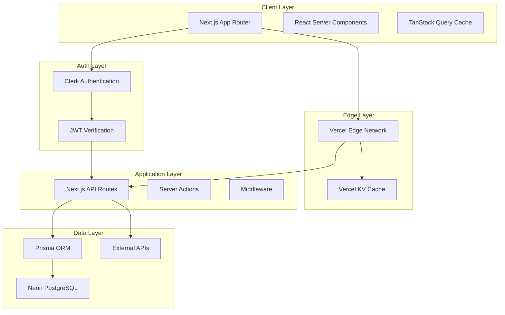
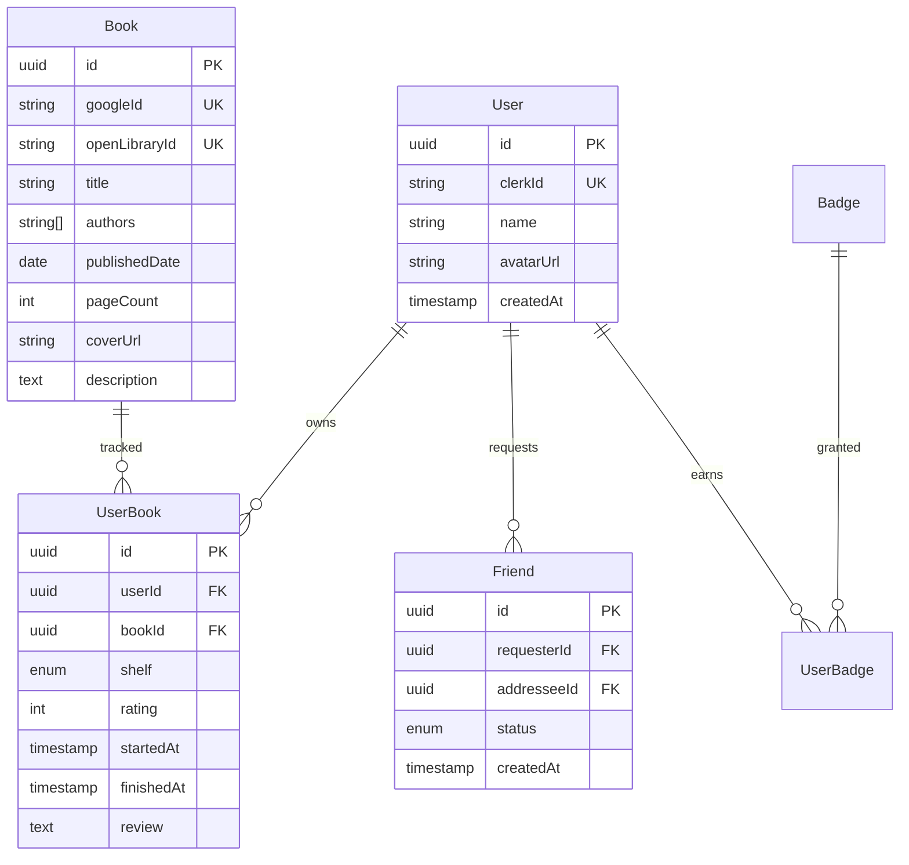

# BookTrackr System Patterns

*Last updated: 25 May 2025*

---

## Architecture Overview

BookTrackr follows a **modern serverless architecture** optimized for global edge delivery and developer experience:



## Core Design Patterns

### 1. Server-First Architecture
**Pattern**: Maximize server-side rendering and minimize client-side JavaScript

**Implementation**:
- React Server Components for static content
- Server Actions for mutations
- Progressive enhancement for interactivity
- Edge-rendered pages with ISR

**Benefits**:
- Faster initial page loads
- Better SEO
- Reduced client bundle size
- Improved accessibility

### 2. Edge-Caching Strategy
**Pattern**: Multi-layer caching with stale-while-revalidate

**Implementation**:
```typescript
// Route Handler caching pattern
export async function GET(request: Request) {
  const cacheKey = generateCacheKey(request.url);
  
  // Try edge cache first
  const cached = await kv.get(cacheKey);
  if (cached && !isStale(cached)) {
    return Response.json(cached.data);
  }
  
  // Fetch fresh data
  const data = await fetchFromDatabase();
  
  // Update cache asynchronously
  kv.set(cacheKey, { data, timestamp: Date.now() }, { ex: 3600 });
  
  return Response.json(data);
}
```

**Cache Hierarchy**:
1. Browser cache (short TTL)
2. Vercel Edge cache (24h TTL)
3. Database query cache (Prisma)
4. Connection pooling (Neon)

### 3. Data Normalization Pattern
**Pattern**: Consistent book data from multiple sources

**Implementation**:
```typescript
interface BookData {
  // Internal fields
  id: string;
  createdAt: Date;
  updatedAt: Date;
  
  // Normalized from external APIs
  googleId?: string;
  openLibraryId?: string;
  isbn10?: string;
  isbn13?: string;
  
  // Canonical data
  title: string;
  authors: string[];
  publishedDate?: Date;
  pageCount?: number;
  coverUrl?: string;
  description?: string;
}

// Normalization service
class BookNormalizer {
  static fromGoogleBooks(data: GoogleBooksAPI): BookData { /* ... */ }
  static fromOpenLibrary(data: OpenLibraryAPI): BookData { /* ... */ }
  static merge(sources: BookData[]): BookData { /* ... */ }
}
```

### 4. Authentication & Authorization Pattern
**Pattern**: JWT-based auth with row-level security

**Flow**:
1. Clerk handles authentication UI and session management
2. JWT tokens passed to API routes
3. Middleware verifies and extracts user context
4. Database queries scoped to authenticated user

**Implementation**:
```typescript
// Middleware pattern
export async function middleware(request: NextRequest) {
  const token = await getAuth(request);
  
  if (!token.userId) {
    return NextResponse.redirect('/sign-in');
  }
  
  // Add user context to headers
  const response = NextResponse.next();
  response.headers.set('x-user-id', token.userId);
  return response;
}

// Database access pattern
export async function getUserBooks(userId: string) {
  return prisma.userBook.findMany({
    where: { userId }, // Row-level security
    include: { book: true }
  });
}
```

## Data Model & Relationships

### Core Entities



### Key Constraints & Indexes

```sql
-- Composite unique constraints
CREATE UNIQUE INDEX user_book_unique ON user_books(user_id, book_id);
CREATE UNIQUE INDEX friend_pair_unique ON friends(
  LEAST(requester_id, addressee_id), 
  GREATEST(requester_id, addressee_id)
);

-- Performance indexes
CREATE INDEX user_books_shelf_idx ON user_books(user_id, shelf);
CREATE INDEX user_books_finished_idx ON user_books(user_id, finished_at) 
  WHERE finished_at IS NOT NULL;
CREATE INDEX books_search_idx ON books USING gin(to_tsvector('english', title || ' ' || authors));
```

## State Management Patterns

### 1. Server State (TanStack Query)
**Pattern**: Cache server state with optimistic updates

```typescript
// Query pattern
export function useUserBooks(shelf?: Shelf) {
  return useQuery({
    queryKey: ['user-books', shelf],
    queryFn: () => fetchUserBooks(shelf),
    staleTime: 5 * 60 * 1000, // 5 minutes
  });
}

// Mutation pattern
export function useAddBook() {
  const queryClient = useQueryClient();
  
  return useMutation({
    mutationFn: addBookAction,
    onMutate: async (newBook) => {
      // Optimistic update
      await queryClient.cancelQueries(['user-books']);
      queryClient.setQueryData(['user-books'], (old) => [...old, newBook]);
    },
    onError: (err, variables, context) => {
      // Rollback on error
      queryClient.setQueryData(['user-books'], context.previousBooks);
    },
  });
}
```

### 2. UI State (Zustand)
**Pattern**: Minimal global UI state

```typescript
interface UIStore {
  theme: 'light' | 'dark' | 'system';
  sidebarOpen: boolean;
  searchQuery: string;
  
  setTheme: (theme: UIStore['theme']) => void;
  toggleSidebar: () => void;
  setSearchQuery: (query: string) => void;
}

export const useUIStore = create<UIStore>((set) => ({
  theme: 'system',
  sidebarOpen: false,
  searchQuery: '',
  
  setTheme: (theme) => set({ theme }),
  toggleSidebar: () => set((state) => ({ sidebarOpen: !state.sidebarOpen })),
  setSearchQuery: (searchQuery) => set({ searchQuery }),
}));
```

## API Design Patterns

### 1. RESTful Route Handlers
**Pattern**: Consistent API structure with proper HTTP methods

```typescript
// /api/books/route.ts
export async function GET(request: Request) {
  const { searchParams } = new URL(request.url);
  const query = searchParams.get('q');
  
  if (query) {
    return searchBooks(query);
  }
  
  return getUserBooks(userId);
}

export async function POST(request: Request) {
  const book = await request.json();
  return addBookToLibrary(userId, book);
}

// /api/books/[id]/route.ts
export async function GET(req: Request, { params }: { params: { id: string } }) {
  return getBook(params.id);
}

export async function PATCH(req: Request, { params }: { params: { id: string } }) {
  const updates = await req.json();
  return updateUserBook(userId, params.id, updates);
}
```

### 2. Server Actions Pattern
**Pattern**: Type-safe mutations with server validation

```typescript
'use server';

import { revalidateTag } from 'next/cache';
import { z } from 'zod';

const AddBookSchema = z.object({
  bookId: z.string().uuid(),
  shelf: z.enum(['WANT', 'READING', 'READ']),
  rating: z.number().min(0).max(10).optional(),
});

export async function addBookAction(formData: FormData) {
  const userId = await getCurrentUserId();
  
  // Validate input
  const result = AddBookSchema.safeParse({
    bookId: formData.get('bookId'),
    shelf: formData.get('shelf'),
    rating: formData.get('rating') ? Number(formData.get('rating')) : undefined,
  });
  
  if (!result.success) {
    return { error: 'Invalid input' };
  }
  
  try {
    await prisma.userBook.create({
      data: {
        userId,
        ...result.data,
      },
    });
    
    // Revalidate cache
    revalidateTag(`user-books-${userId}`);
    
    return { success: true };
  } catch (error) {
    return { error: 'Failed to add book' };
  }
}
```

## Performance Optimization Patterns

### 1. Component-Level Optimizations
- Server Components for static content
- Client Components only when needed (interactions)
- Lazy loading for heavy components
- Image optimization with Next.js Image

### 2. Database Optimizations
- Connection pooling with Prisma Data Proxy
- Selective field loading
- Pagination for large datasets
- Aggregation queries for stats

### 3. Caching Strategy
- Static generation for marketing pages
- ISR for dynamic but cacheable content
- Edge caching for API responses
- Browser caching for static assets

## Error Handling Patterns

### 1. Graceful Degradation
```typescript
export default function BookList() {
  return (
    <Suspense fallback={<BookListSkeleton />}>
      <ErrorBoundary fallback={<BookListError />}>
        <BookListContent />
      </ErrorBoundary>
    </Suspense>
  );
}
```

### 2. API Error Handling
```typescript
export async function fetchBooks(): Promise<Book[]> {
  try {
    const response = await fetch('/api/books');
    
    if (!response.ok) {
      throw new APIError(response.status, await response.text());
    }
    
    return response.json();
  } catch (error) {
    // Log to monitoring service
    logger.error('Failed to fetch books', { error });
    
    // Return fallback or throw user-friendly error
    throw new Error('Unable to load books. Please try again.');
  }
}
```

---

*This document captures the core technical patterns and architectural decisions that guide BookTrackr development.*
